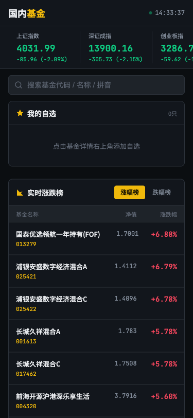
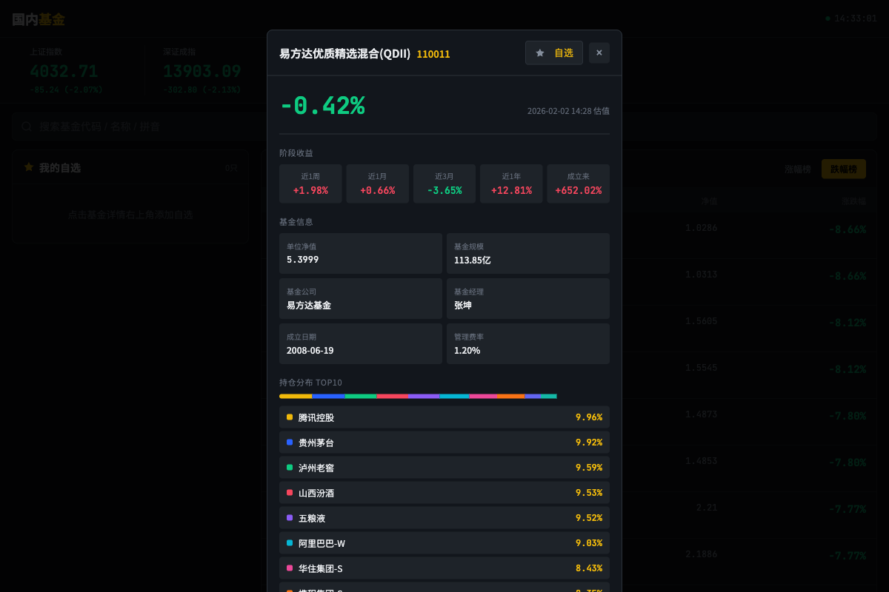

<p align="center">
  
  
  
</p>

<h1 align="center">🇨🇳 国内基金 - 实时行情系统</h1>

<p align="center">
  <strong>基于 Cloudflare Workers 的国内基金实时行情追踪系统</strong>
</p>

<p align="center">
  <a href="https://fund-cn.chuankangkk.top">🌐 在线体验</a> •
  <a href="https://fund.chuankangkk.top">🌍 海外基金版</a> •
  <a href="#功能特性">✨ 功能特性</a> •
  <a href="#快速部署">🚀 快速部署</a>
</p>

## 📸 界面预览

<table>
  <tr>
    <td align="center"><strong>PC端界面</strong></td>
    <td align="center"><strong>移动端界面</strong></td>
  </tr>
  <tr>
    <td></td>
    <td></td>
  </tr>
</table>

<p align="center">
  
  <br>
  <em>基金详情弹窗 - 估值、阶段收益、持仓分布</em>
</p>

## ✨ 功能特性

| 功能 | 说明 |
|------|------|
| 📊 **大盘指数** | 上证、深证、创业板、科创50 实时行情 |
| 📈 **盘中估值榜** | 热门基金实时估值涨跌排行（每30秒刷新） |
| 📉 **净值涨跌榜** | 基金净值涨跌排行（收盘数据） |
| 🔍 **基金搜索** | 支持代码、名称、拼音即时搜索（2万+基金） |
| ⭐ **自选管理** | 弹窗右上角添加/移除，localStorage 持久化 |
| ⏱️ **实时估值** | 自选基金每10秒自动更新估值 |
| 📱 **响应式布局** | PC双栏 / 手机单栏 自适应 |
| 📋 **基金详情** | 估值、阶段收益、基金信息、持仓TOP10 |
| 🎨 **专业UI** | 交易所风格深色主题，SVG矢量图标 |

## 🚀 快速部署

### 前置要求

- Node.js 18+
- Cloudflare 账户
- Wrangler CLI

### 部署步骤

```bash
# 1. 克隆项目
git clone https://github.com/1837620622/fund-cn.git
cd fund-cn

# 2. 安装依赖
npm install

# 3. 登录 Cloudflare
npx wrangler login

# 4. 部署到 Workers
npx wrangler deploy
```

### 自定义域名

编辑 `wrangler.toml` 添加你的域名：

```toml
routes = [
  { pattern = "your-domain.com", custom_domain = true }
]
```

## 🔗 相关项目

| 项目 | 说明 | 链接 |
|------|------|------|
| 🌍 **海外基金** | 美股、港股基金实时行情 | [fund.chuankangkk.top](https://fund.chuankangkk.top) |
| 🇨🇳 **国内基金** | A股基金实时行情 | [fund-cn.chuankangkk.top](https://fund-cn.chuankangkk.top) |

## 🛠️ 技术栈

- **运行时**: Cloudflare Workers (Edge Runtime)
- **语言**: JavaScript ES6+
- **UI框架**: 原生 HTML/CSS/JS
- **数据源**: 天天基金 / 东方财富 API
- **存储**: localStorage (自选基金)

## 📁 项目结构

```
fund-worker/
├── src/
│   └── index.js      # Worker 主文件（API + 前端）
├── fund-list.json    # 基金列表数据
├── wrangler.toml     # Cloudflare 配置
├── package.json      # 依赖配置
├── screenshots/      # 截图目录
│   ├── desktop.png   # PC端截图
│   ├── mobile.png    # 移动端截图
│   └── modal.png     # 弹窗截图
└── README.md         # 项目说明
```

## 📡 API 接口

| 接口 | 说明 |
|------|------|
| `GET /api/indices` | 获取大盘指数 |
| `GET /api/ranking?type=up` | 获取净值涨幅榜 |
| `GET /api/ranking?type=down` | 获取净值跌幅榜 |
| `GET /api/ranking/estimate?type=up` | 获取实时估值涨幅榜 |
| `GET /api/ranking/estimate?type=down` | 获取实时估值跌幅榜 |
| `GET /api/fund/estimate?code=110011` | 获取基金估值 |
| `GET /api/fund/{code}/detail` | 获取基金详情 |
| `GET /api/fund/{code}/portfolio` | 获取持仓分布 |
| `GET /api/fund/{code}/performance` | 获取阶段收益 |
| `GET /api/fund-list` | 获取基金列表 |

## 📞 联系方式

- **微信**: 1837620622（备注来意）
- **作者**: 万能程序员

## ⚠️ 免责声明

本项目仅供学习交流使用，数据来源于公开接口，不构成任何投资建议。投资有风险，入市需谨慎。

## 📄 开源协议

[MIT License](LICENSE) © 2025 万能程序员
